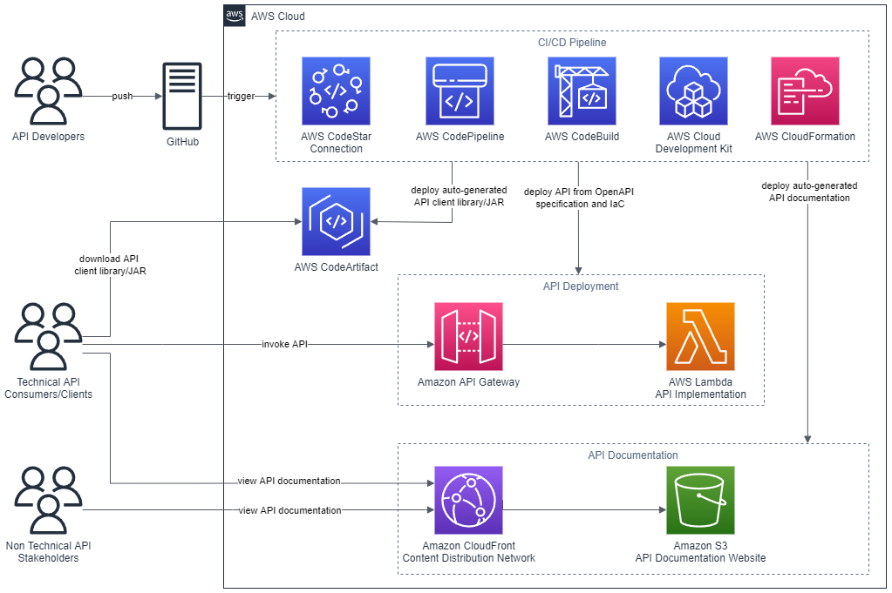

## Deploy and manage OpenAPI (Swagger) RESTful APIs with the AWS Cloud Development Kit (AWS CDK)

The code in this repository accompanies the blog post *Deploy and manage OpenAPI (Swagger) RESTful APIs with the AWS Cloud Development Kit (AWS CDK)* located [here](https://aws.amazon.com/blogs/devops/deploy-and-manage-openapi-swagger-restful-apis-with-the-aws-cloud-development-kit/).  This code demonstrates how to:

- Deploy a RESTful API stage to [Amazon API Gateway](https://aws.amazon.com/api-gateway/) from an OpenAPI specification.
- Build and deploy an [AWS Lambda function](https://aws.amazon.com/lambda/) which contains the API functionality.
- Auto-generate API documentation and publish this to an [Amazon S3-hosted](https://aws.amazon.com/s3/) website served by the [Amazon CloudFront](https://aws.amazon.com/cloudfront/) content delivery network(CDN) service. This provides technical and non-technical stakeholders with versioned, current, and accessible API documentation.
- Auto-generate client libraries for invoking the API and deploy these to [AWS CodeArtifact](https://aws.amazon.com/codeartifact/) which is a fully-managed artifact repository service. This enables API client development teams that seek to integrate with different versions of the API in different environments.

## Architecture

## Instructions

Please refer to the [blog post](https://aws.amazon.com/blogs/devops/deploy-and-manage-openapi-swagger-restful-apis-with-the-aws-cloud-development-kit/) for instructions on how to run this project.

## Security

See [CONTRIBUTING](CONTRIBUTING.md#security-issue-notifications) for more information.

## License

This library is licensed under the MIT-0 License. See the LICENSE file.

